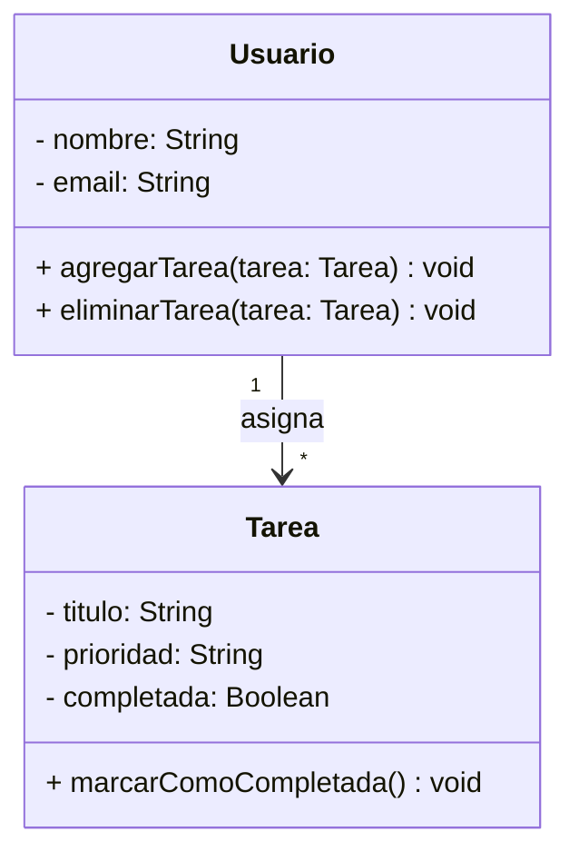

# TaskMaster - Aplicacioón de Gestión de tareas

## Descripción

TaskMaster es una aplicación diseñada para mejorar la productividad, permitiendo gestionar tareas de manera eficiente. Con esta herramienta, los usuarios pueden organizar sus actividades diarias de manera sencilla y eficaz.

## Características

- :heavy_check_mark: Creación y edición de tareas.
- :calendar: Asignación de fechas límite y prioridades.
  - Prioridad baja, media y alta.
  - Fechas límite personalizadas con control de calendario
- :file_folder: Organización en categorías y etiquetas.
- :white_check_mark: Marcar tareas como completadas.
- :bell: Notificaciones y recordatorios automáticos.
- :bar_chart: Visualización en lista y tablero Kanban.

## Instalación

Para instalar y ejecutar la aplicación, sigue los siguiente pasos:

```bash

# clonar el repositorio
git clone https://github.com/usuario/taskmaster.git
cd taskmaster

#Instalar dependencias
npm install

#Ejecutar la aplicación
npm start
```

## Uso de la API

TaskMaster proiporciona una API REST para gestionar tareas. Acontinuación un ejemplo de como crear una tarea usando **JavaScript**

```javaScript
fetch("https://api.taskmaster.com/tareas", {
    method: "POST",
    headers: { "Content-Type": "application/json" },
    body: JSON.stringily({ titulo: "Nueva tarea" , prioridad: "Alta" }) 
})
.then(response => response.json())
.then(data => console.log("Tarea creada:", data));
```

## Fórmula de Productividad

La eficiencia del usuario se calcula con la siguiente fórmula:

$$E = \frac{\text{Tareas Completadas}}{\text{Tareas Totales}} \times 100$$
donde:

- *E* es la eficiencia en porcentaje
- $\text{Tareas Completadas}$ es el número de tareas finalizadas por el usuario
- $\text{Tareas Totales}$ es el número total de tareas asignadas

## Diagrama de Clases

La siguiente representación en UML muestra la estructura del sistema:



## Capturas de Pantalla

A continuación, una vista previa de la interfaz de usuario:

.png)

Para registrar una nueva tarea, sigue estos pasos:

1. Haz click en el botón Nueva Tarea
2. Completa el formulario con los datos de la tarea
    1. **Titulo:** Nombre de la tarea.
    2. **Prioridad:** Nivel de importancia (baja, media, alta).
    3. **Fecha limite**: Día y hora de vencimineto.
 3. Haz clic en Guardar para crear la tarea.
 4. ¡Listo! La tarea se haregistrado correctamente

Si deseas que el título de la tarea sea visible en negrita, escribe entre dobles asteriscos: \*\*Título de la Tarea\*\*.

## Historial de versiones

En la siguiente tabal se muestran las versiones publicadas de la aplicación
| Versión | Fecha | Descripción |
| ---:    | :---: | :---        |